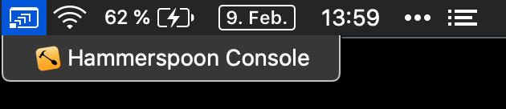

# MinimizedWindowsMenu

macOS menubar menu for showing and switching to minimized windows. Shows windows belonging to the current space only.



## Installation

* Install [Hammerspoon](https://www.hammerspoon.org/)

* Install [\_asm.undocumented.spaces](https://github.com/asmagill/hs._asm.undocumented.spaces) module

* Install `MinimizedWindowsMenu.spoon` (this repository) by downloading or cloning it to `~/.hammerspoon/Spoons/`

* Load and configure the Spoon from `~/.hammerspoon/init.lua`:

```
hs.loadSpoon("MinimizedWindowsMenu"):start()
```

* Reload Hammerspoon


## Usage

* Open menubar menu.

* Click on window you want to make visible again.

